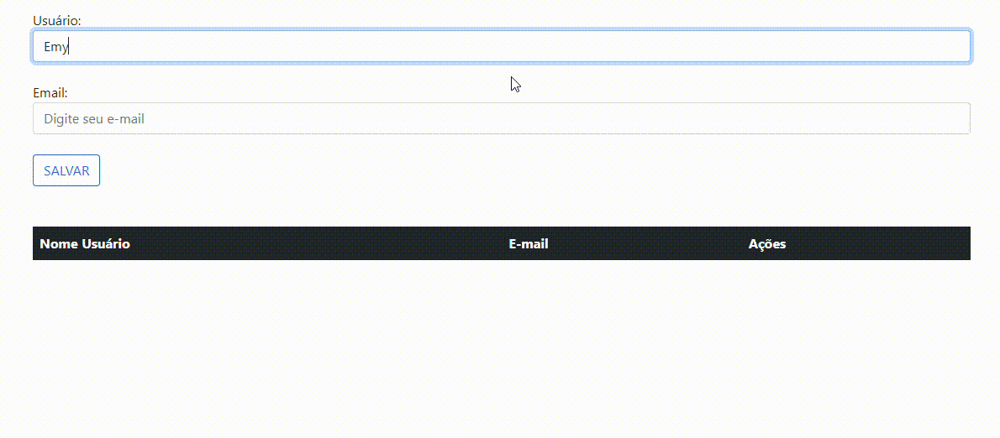

# **Página de Login e Cadastro Atualizada**
A proposta dessa atividade foi utilizar o [projeto anterior de Cadastro](https://github.com/EmillyBonfim/login-cad) e atualiza-lo adicionando novo campo de preenchimento e validações de E-mail.

## **Explicação** 
O projeto consiste basicamente em uma página de login e uma de cadastro, que usa funcionalidades de autenticação e gerenciamento de usuário em uma página Web. 

 **Funcionalidades**

- Direcionamento de páginas
- Validação de E-mail 
- Pop-up (Alert)
- Editar campos
- Excluir campos

##  **Página de Login** (inicial)
O projeto inicia em uma página de Login, onde Nome de Usuário e E-mail são obrigatórios para ir para página de cadastro. Após a preenchimento correto das credenciais ele te direcionará a página de cadastro, caso o usuário preencher o campo de E-mail de maneira incorreta um Alert pedira para que ele digite e e-mail de maneira correta.

## **Interface** 

## **Página de Cadastro** 
A página de cadastro possui dois campos de preenchimentos obrigatórios, Usuário e E-mail, se o usuário preencher o campo de e-mail de maneira incorreta um alert será apresentado pedindo o preenchimento correto do campo, após preenchimento correto ele envia os dados para uma tabela, nela podemos editar os dados preenchidos pelo usuário e também exclui-los.

## **Interface** 

## **Tecnologias Desse Projeto**
 

 
   
   
   
 

 
 
##
 
## **Quer me conhecer?**
 

   
   
    

